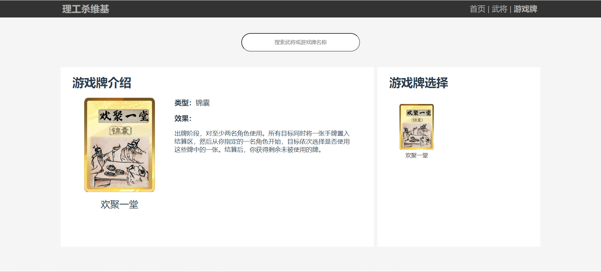

# 理工杀维基

## 项目简介

“理工杀维基”是本人开源项目“理工杀”的武将/游戏牌百科介绍网页，支持卡牌信息查看、卡牌名称搜索、卡牌按信息筛选操作。（部分功能暂未实装，请等待后续版本更新。）

## 项目实现

使用Vue3框架开发，并综合运用Element-plus组件库。

## 界面展示

首页
 

武将介绍页面
 

游戏牌介绍页面
 

## 测试环境

Windows10/11，Chrome122.0.6261.112，vue3.4.21，vue-router4.3.0，Element-plus2.6.1，unplugin-auto-import0.16.7，unplugin-vue-components0.25.0

